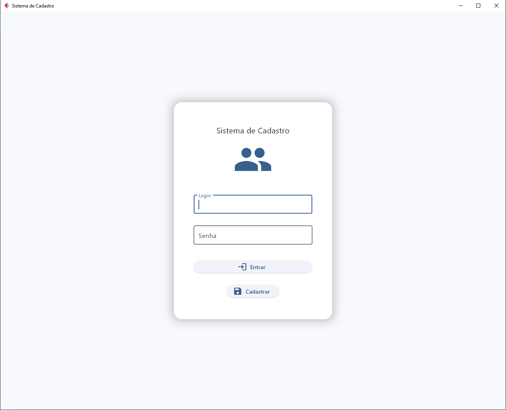

# Flet App

Um Sistema de Cadastro que utiliza a biblioteca Flet. O sistema inclui funcionalidades para validação de cadastros e confirmação antes de salvar os dados no banco de dados, além de permitir a edição e exclusão de registros de usuários. As informações de tentativas de login com credenciais incorretas ou não cadastradas, bem como as exclusões, são registradas em um arquivo de log.

