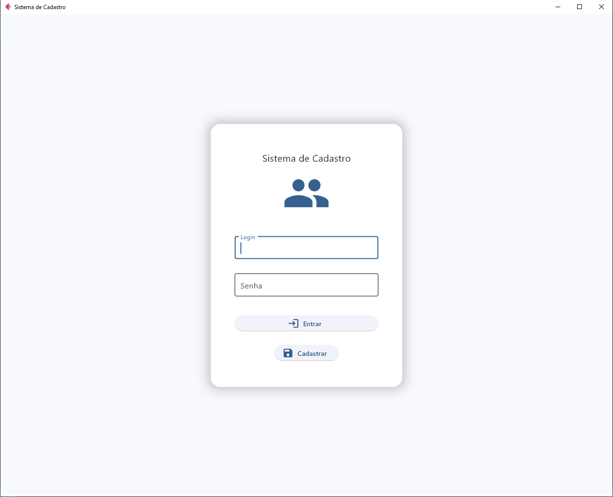
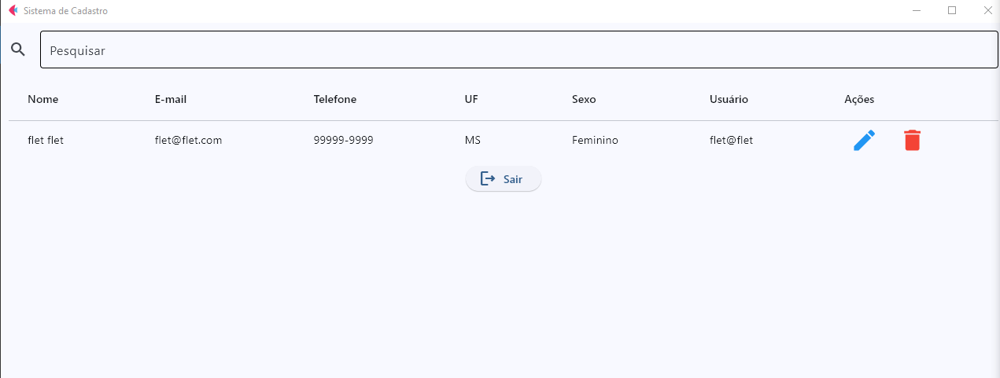
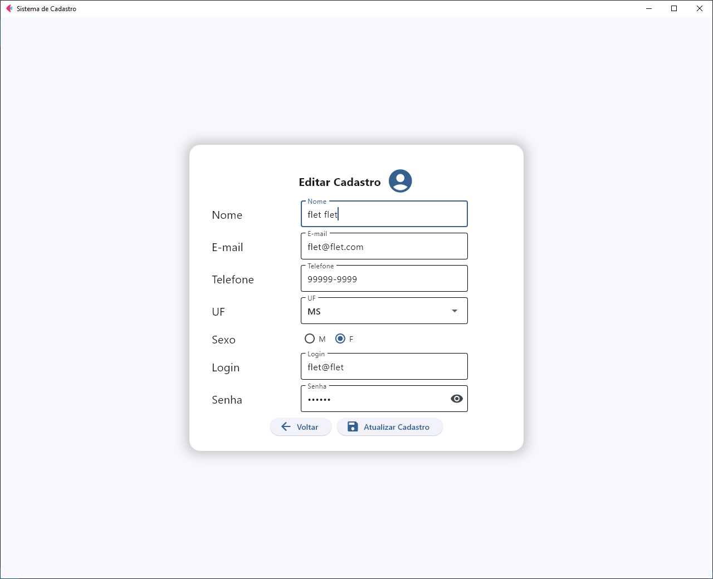

# Sistema de Cadastro em Flet

Este projeto tem como objetivo oferecer um sistema completo e intuitivo para gerenciamento de usuários, utilizando a biblioteca Flet para criar interfaces gráficas com Python. O sistema foca na validação dos dados inseridos, segurança nas operações de cadastro e edição, além de manter um registro detalhado das atividades, como tentativas de login e exclusões.

## Funcionalidades 
Este sistema inclui as seguintes funcionalidades principais:
1. Cadastro de usuários com validação de dados;
2. Edição e exclusão de registros de usuários;
3. Registro em log:
  - tentativas de login com credenciais incorretas ou não cadastradas;
  - exclusão de usuários.

## Pré-requisitos
1. Python;
2. Biblioteca Flet;  
3. Ambiente virtual.

## Telas do Sistema
### Tela Home
Página inicial do sistema.

### Tela de Usuários Cadastrados
Exibe a lista de todos os usuários registrados no sistema.

### Tela de Edição do Cadastro
Tela para editar os dados de um cadastro existente.

## Contribuições
Críticas construtivas e contribuições são bem-vindas. Sinta-se à vontade para abrir issues ou pull requests para melhorias e correções.

## Referências
- [Python](https://www.python.org/)
- [Flet.dev](https://flet.dev) 

## Licença
Este projeto está licenciado sob a MIT License.

